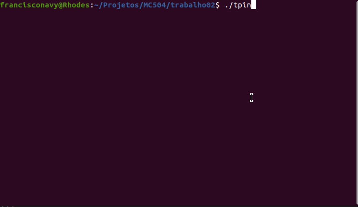
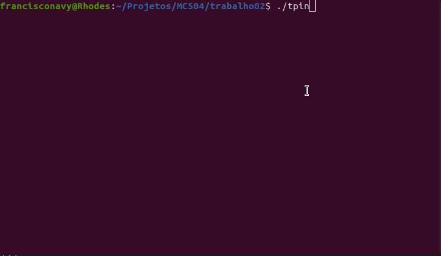

# Projeto 2 - Animação multithread com semáforos

Projeto 2 - MC504: Sistemas Operacionais

Francisco Namias Vicente - 216028
Gustavo Praciano Barros - 217555
Hitalo Cesar Alves - 217878
Luiz Felipe Eiske Kina - 183020

## Visão Geral
O projeto visa simular um ateliê de pintores que realizam diferentes tipos de manipulações com imagens. O exemplo dos barbeiros dorminhocos foi utilizado como base de inspiração, mas os parâmetros e as exigências do projeto são distintos. Cada pintor possui uma especialidade de alteração de imagem e cada cliente possui uma necessidade distinta. No entanto, o ateliê só possui uma fila em que a capacidade máxima dessa fila deve ser respeitada.

O arquivo *pintores.cpp* foi criado para utilizar a biblioteca *pthread.h* para gerenciar os semáforos de estado dos clientes e dos pintores para garantir uma visibilidade melhor de como o processo está sendo realizado internamente, além de semáforos para gerenciar como estavam as filas, os clientes e os pintores dentro do ateliê para garantir a corretude do programa e dos processos.

## Instruções de uso
Para rodar o programa completo basta rodar o comando:
 - g++ tiposPintores.cpp -pthread -o tpin -lncursesw

Além disso, você pode encontrar os arquivos para processamento das imagens dentro da pasta *processamentoImagens*. 

## Estratégia Multithread adotada

Inicialmente são criadas duas estruturas para representar tanto os clientes quanto os pintores, a estrutura dos clientes possui a identificação, o tipo de operação que quer que seja realizado e a imagem, já a estrutura do pintor possui a identificação e o tipo de operação que ele realiza. Na função *main* do código, são iniciados semáforos para as cadeiras, para os estados, para as cadeiras de cada um dos pintores, para os clientes nas cadeiras, para operação de escrever no painel de cada pintor, para ler no painel para cada pintor e para cada pintor para sinalizar que teve a imagem alterada.
A partir disso, threads são criadas para cada pintor e depois, são criadas as threads dos clientes. Cada thread dos pintores utiliza o semáforo para ler no próprio painel para ver se está disponível e depois escrever no painel próprio que está realizando uma operação. Depois de realizar a operação é indicado no semáforo que a imagem do pintor está alterada.
Cada thread do cliente realiza a operação de chegar no ateliê e para sentar ele olha no semáforo de cadeiras, se não tiver mais cadeiras disponíveis ele apenas vai embora. Se tiver uma cadeira disponível ele senta em uma cadeira e passa a observar o semáforo do tipo de operação que ele quer realizado até que esteja disponível para poder ter sua imagem nova, ao encontrar o pintor livre ele libera a escrita no painel para outro pintor e coloca no semáforo da cadeira do pintor a sua identificação. Depois que o serviço é realizado, o cliente libera a cadeira do pintor e deixa o ateliê. O pintor então volta a tentar escrever em seu painel, e o loop continua até que acabem os clientes.

